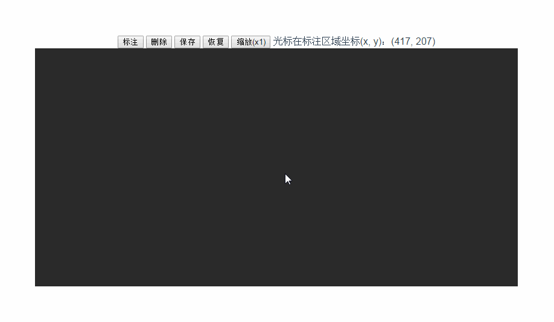

# vue-canvas

> 在vuejs框架下使用canvas组件进行多边形绘制

实现的效果如下：


##组件设计思路：
+ 1，由外部开关`markState`来控制画布组件是否处于标注状态。标注状态下，才可以进行划线标注。
+ 2，标注状态下，监听mousedown，mousemove,mouseup三个事件，进行图形绘制。绘制过程中会track鼠标的轨迹。绘制完成后（触发了自动闭合），可以点击顶点进行拖动调整。对于未闭合多边形，绘制过程中可以右键取消绘制。
+ 3，图形分为激活状态（白色）和非激活状态（暗色），点击多边形内部可以激活多边形。在内部按住鼠标左键或中键可以整体拖动多边形。不允许拖出到画布外。
+ 4，可以保存画布中图形坐标数据，在删除后可以恢复图形。可以自己实现缩放画布
保存的数据格式如下：
```
[
  {
    "points":[
        { "x": 254, "y": 106 },
        { "x": 165, "y": 213 },
        { "x": 260, "y": 316 },
        { "x": 384, "y": 198 },
        { "x": 341, "y": 104 },
        { "x": 273, "y": 97 } ],
    "text": "Text desc"
  },
  {
    ...
  }
]
```
+ 5，多变形绘制完成后，可以展示说明字符，目前实现比较简单

###可以优化的点:
+ 1，多变形状态的检测，各边之间不允许交叉。
+ 2，多个多边形间不允许位置重叠
+ 3，标注文案位置能够自适应 
+ ......